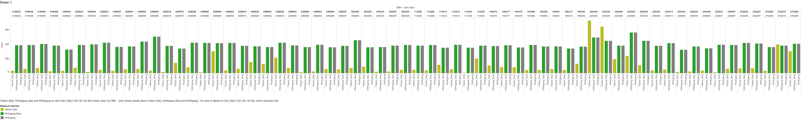
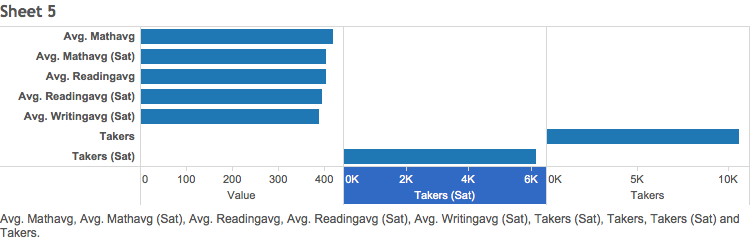
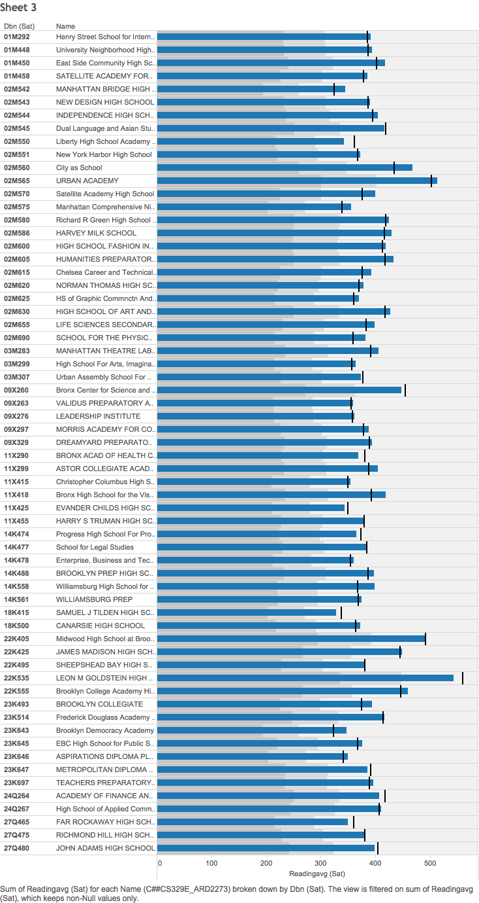
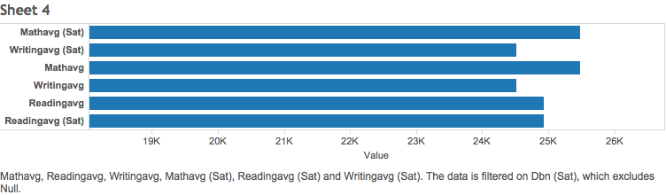

Here are my embedded plots from Tableau.

#The first compiles the sum of writing SAT scores from schools sorted by district number in New York City. The graph shows a comparison between 2010 and 2012 scores with the number of takers. Sat denotes 2010.

#This graph shows the average between 2010 and 2012 scores rather than the total sum. The averages are fairly similar, but notice the different in number of takers in 2012. This suggests an increase in students, population, or college enrollment.

  

# This sheet shows that the reading average increased overall from 2010 to 2012.

  

#The last demonstrates overall change in terms of total sum averages alone. For the most part, there are not that many changes between 2010 and 2012.

    